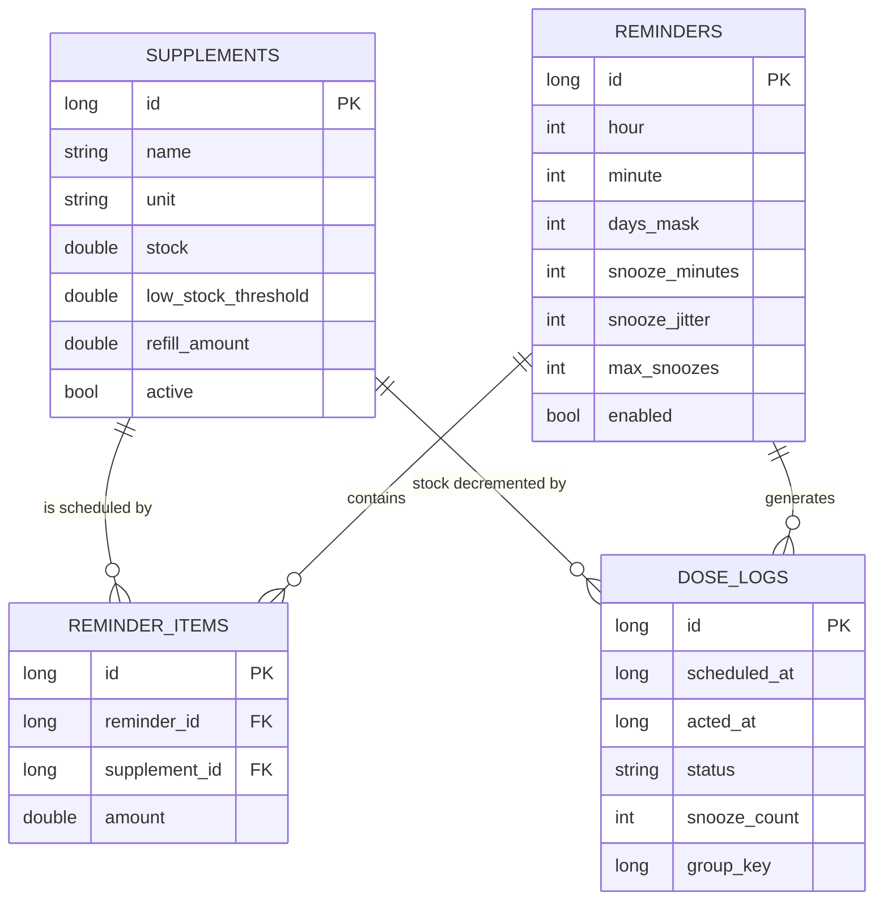
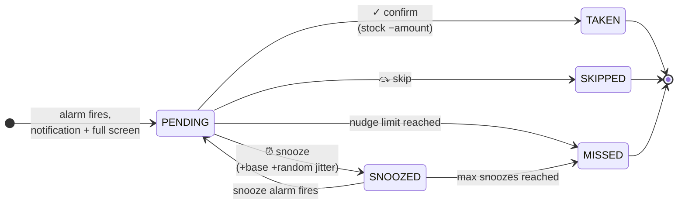
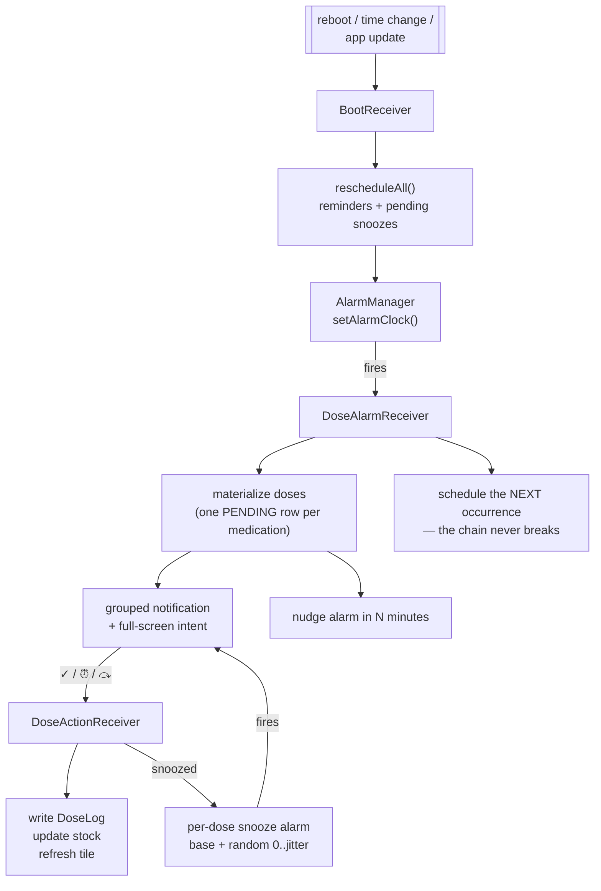
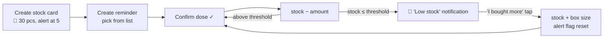

<div align="center">

# 💊 DoseWear

**A standalone Wear OS medication & supplement tracker.**
No phone. No cloud. No account. Your data never leaves the watch.

<p>
  <a href="README.md"></a>
  <a href="README.tr.md"></a>
</p>

<p>
  
  
  
  
  
</p>

</div>

---

## Screenshots

<!-- Drop your PNGs into docs/screenshots/ with these names and they'll show up here. -->

| Home | Reminders | Dose confirmation | Stock card |
|:---:|:---:|:---:|:---:|
|  |  |  |  |

| Reminder editor | History | Settings & diagnostics | Tile |
|:---:|:---:|:---:|:---:|
|  |  |  |  |

---

> [!WARNING]
> **Not a medical device.** DoseWear is a personal reminder tool. It does not give medical advice
> and it is not certified for clinical use. Alarm delivery ultimately depends on your watch's OS and
> its battery policies — never rely on it alone for critical medication. Always verify with the
> built-in delivery test before trusting it (see [Verifying reliability](#verifying-reliability)).

---

## Why this exists

Most medication reminders are phone apps with a watch companion. If you leave your phone in another
room, you miss the dose. DoseWear runs **entirely on the watch**: you add medications on the watch,
you get vibrated on the watch, you confirm on the watch, and the history lives on the watch.

It also solves two things generic reminder apps get wrong:

1. **Three pills at 09:00 are not one reminder.** They're three things you confirm independently —
   and if you snooze two of them, they must not come back at the same minute and bury each other.
2. **A reminder without stock awareness is half a system.** Confirming a dose should decrement what
   you actually have in the drawer, and tell you to buy more *before* you run out.

---

## Features

### Core

- 🔕 **Fully standalone** — `com.google.android.wearable.standalone = true`, zero phone dependency
- 🔒 **Offline by design** — Room/SQLite on the watch, no network permission, no telemetry, no account
- ⏰ **Exact alarms that survive reboots** — rescheduled on `BOOT_COMPLETED`, time change and app update
- 🔋 **No background services** — no foreground service, no `WorkManager`, no polling
- 🌍 **Follows the watch language** — Turkish on a Turkish watch, English everywhere else
- 🧩 **Tile + watch-face complication** showing the next dose

### Dosing

- 💊 **Multiple medications per reminder**, each confirmed separately
- ⏰ **Configurable snooze with anti-collision jitter** — snoozed doses spread out instead of stacking
- 📣 **Full-screen confirmation** that wakes the screen over the lock screen, with continuous alarm-style vibration until you act
- 🔁 **Escalating nudges** — re-vibrates every N minutes until confirmed, then logs the dose as missed
- 🔥 **Streaks & daily progress** to make confirming feel worth it

### Stock

- 📦 **A stock card per supplement** — units, remaining count, low-stock threshold, box size
- ➖ **Automatic decrement** on every confirmed dose
- 🛒 **"I bought more"** notification action that refills the stock in one tap

---

## How it works

### Data model

Four Room tables. The confirmation mechanism *is* `dose_logs`.



| Table | What it holds |
|---|---|
| `supplements` | **Stock card** — one row per medication/supplement, with everything needed to know when to reorder |
| `reminders` | **A time** — hour, minute, day bitmask, and its own snooze policy |
| `reminder_items` | The N:N link, plus how much of that supplement this reminder takes |
| `dose_logs` | **Every scheduled dose and what you did about it.** This is the confirmation log and the history |

`dose_logs` denormalizes the supplement name, so deleting a supplement never corrupts your history.

### Dose lifecycle



Only `TAKEN` touches stock. Skipping and missing deliberately leave it alone.

### The alarm chain



**Why `setAlarmClock()` instead of `setExactAndAllowWhileIdle()`?**
`setExactAndAllowWhileIdle` is exempt from Doze but is still throttled by many OEM battery layers
(Xiaomi HyperOS in particular), and Android only guarantees roughly one such alarm per app per Doze
window. `setAlarmClock` is what the system treats as a *real alarm clock*: highest priority, exempt
from Doze and from most OEM restrictions. The trade-off is a small alarm icon in the status bar —
you can switch back to `setExactAndAllowWhileIdle` in Settings if you prefer.

`WorkManager` is deliberately **not** used: it gives no minute-level guarantee.

### Multiple medications at the same time

Two mechanisms work together:

**1 — Grouped reminders.** One reminder can hold any number of supplements. They arrive as a single
notification, the full-screen sheet lists them all, and each one has its own ✓ / ⏰ / ⤼ row.
There's a "take all" shortcut when you did just take all of them.

**2 — Anti-collision snooze.** Snooze duration is set per reminder in the UI (default 10 min). On top
of it, `0..jitter` minutes of randomness are added — **computed separately for each dose**:

```
dose A → now + 10 + rand(0..3) = 09:12
dose B → now + 10 + rand(0..3) = 09:14
```

So snoozing two of three medications never produces two notifications in the same minute. Set jitter
to `0` to turn it off entirely.

### Encouraging confirmation

- The dose notification is `setOngoing(true)` — it can't be swiped away, only acted on
- `setFullScreenIntent` wakes the screen and opens the confirmation sheet over the lock screen
- Escalating waveform vibration on `USAGE_ALARM`
- If it's still unconfirmed, it re-vibrates every N minutes (default 5, configurable) and after N
  nudges (default 3) the dose is recorded as `MISSED` rather than nagging forever
- Positive side: the home screen shows a daily `taken / planned` bar and a 🔥 consecutive-day streak

### Stock flow



The alert flag prevents the same low-stock warning from firing on every single dose.

---

## Screens

| Screen | Purpose |
|---|---|
| **Home** | Today's progress bar, streak, next dose, doses awaiting confirmation, low-stock warnings |
| **My supplements** | All stock cards, colour-coded, low ones flagged |
| **Supplement detail** | Big remaining-stock readout, ± adjust, "I bought more", recent movements |
| **Supplement editor** | Name, strength, unit, stock, threshold, box size, colour, active/passive |
| **Reminders** | All reminders with time, days and medication count |
| **Reminder editor** | Time steppers, day picker, multi-select supplements with per-item amount, snooze policy |
| **Dose confirmation** | Full-screen; per-medication ✓ / ⏰ / ⤼, plus "take all" |
| **History** | Day by day, taken / snoozed / skipped / missed, with snooze counts |
| **Settings** | Permission status, alarm mode, nudge policy, defaults, **delivery diagnostics** |
| **Tile & complication** | Next dose (or pending count) at a glance |

Text entry uses Wear's standard `RemoteInput` screen (keyboard / handwriting / voice). Every numeric
field is a ± stepper, so you never need a keyboard on a watch.

---

## Build & install

There is no Play Store build — this is sideloaded via ADB.

```bash
# On the watch:
#   Settings → System → About → tap "Build number" 7 times
#   Settings → Developer options → enable "ADB debugging" + "Debug over Wi-Fi"

adb pair <WATCH_IP>:<PAIRING_PORT>     # enter the code shown on the watch
adb connect <WATCH_IP>:<PORT>
adb devices                            # your watch should be listed

./gradlew installDebug
# or
adb install -r app/build/outputs/apk/debug/app-debug.apk
```

Requirements: Android Studio (AGP 9), JDK 17+, a Wear OS 5+ watch (`minSdk 30`).

### Release build (signed APK)

The debug APK you get from Android Studio works, but its signature expires after a year and
changes with the machine. For long-term personal use, sign with your own key:

```bash
# 1. Create a keystore once, in the project root
keytool -genkey -v -keystore dosewear.jks -alias dosewear \
        -keyalg RSA -keysize 2048 -validity 10000

# 2. Copy keystore.properties.example -> keystore.properties and fill it in
#    (both the .jks and the .properties are gitignored)

# 3. Build
./gradlew assembleRelease
# -> app/build/outputs/apk/release/app-release.apk

# 4. Install (uninstall the debug build first — different signature)
adb uninstall com.example.dosewear
adb install -r app/build/outputs/apk/release/app-release.apk
```

From then on, bump `versionCode` in `app/build.gradle.kts` and `adb install -r` upgrades in
place, keeping the database. **Back up `dosewear.jks` and its passwords** — lose them and the
only way to update is a full uninstall, which wipes the stock and history.


---

## After installing

Open the app → **Settings**. All three rows must be ✅:

| Row | What it does |
|---|---|
| Exact alarm permission | `SCHEDULE_EXACT_ALARM` — usually auto-granted thanks to `USE_EXACT_ALARM` |
| **Battery optimisation** | Adds the app to the Doze allowlist — **the single most important item** |
| Full-screen alert permission | `USE_FULL_SCREEN_INTENT` on Android 14+ |

### Xiaomi HyperOS (and other aggressive OEM skins)

The allowlist alone is often not enough. On HyperOS also do:

1. **Settings → Apps → DoseWear → Battery saver → "No restrictions"**
2. **Autostart** → enable DoseWear
3. In the recents view, **lock the DoseWear card** (swipe down → padlock)
4. Some builds also have **Security app → Battery → App battery saver → DoseWear → No restrictions**

---

## Verifying reliability

Settings → **Diagnostics** records, for every alarm, the *scheduled vs. actual* fire time and the
worst delay observed so far. Run these in order:

1. **"Set test alarm (2 min)"** — baseline while the app is open. Expect `✅ On time`.
2. Repeat with the watch off your wrist and the screen off (light Doze).
3. **"Set overnight test (8 h)"** — take the watch off the charger and leave it overnight.
   In the morning: did the notification arrive, and what's the delay? A worst delay above ~2 minutes
   means the OEM layer is throttling you — revisit the steps above.
4. **Reboot test** — power cycle the watch and confirm the next dose fires *without* tapping
   "Reschedule alarms". That proves `BootReceiver` did its job.

---

## Project structure

```
app/src/main/java/com/example/dosewear/
├── DoseWearApp.kt              Application: channels + alarm-chain self-heal on launch
├── data/
│   ├── Model.kt                Entities, DoseStatus, relations, formatters
│   ├── Dao.kt                  Room DAOs (Flow-based reads)
│   ├── AppDatabase.kt          Room database
│   ├── DoseRepository.kt       All business logic: confirm, snooze, stock, adherence, streak
│   └── Prefs.kt                Settings + alarm delivery diagnostics
├── alarm/
│   ├── AlarmScheduler.kt       setAlarmClock / setExactAndAllowWhileIdle, next-occurrence math
│   ├── DoseAlarmReceiver.kt    Reminder fired · snooze expired · nudge
│   ├── DoseActionReceiver.kt   Notification buttons → DoseLog + stock
│   └── BootReceiver.kt         Reschedule everything after reboot / time change / update
├── notif/DoseNotifier.kt       Grouped notifications, full-screen intent, vibration, low stock
├── presentation/               Compose UI, navigation, full-screen AlarmActivity
├── tile/MainTileService.kt     ProtoLayout tile: next dose
├── complication/               Watch-face complication: next dose
└── util/Surfaces.kt            Tile/complication refresh (event-driven, never periodic)
```

## Tech stack

Kotlin · Jetpack Compose for Wear (Material 2.5) · Wear Compose Navigation · Room (KSP) ·
AlarmManager · NotificationCompat · ProtoLayout (Tile) · Watch Face Complications ·
`androidx.wear:wear-input` for text entry.

No dependency injection framework, no network stack, no analytics.

---

## Roadmap

- [ ] Backup / restore of the database
- [ ] Weekly adherence chart
- [ ] "As needed" (PRN) doses without a fixed time
- [ ] Per-supplement notes and photos

## Contributing

Issues and PRs welcome. This started as a personal project for one watch, so expect rough edges on
hardware I can't test. If you find an OEM whose battery layer breaks the alarms, please open an issue
with the **Diagnostics** numbers from the Settings screen — that's the most useful data point.

## License

[MIT](LICENSE)
