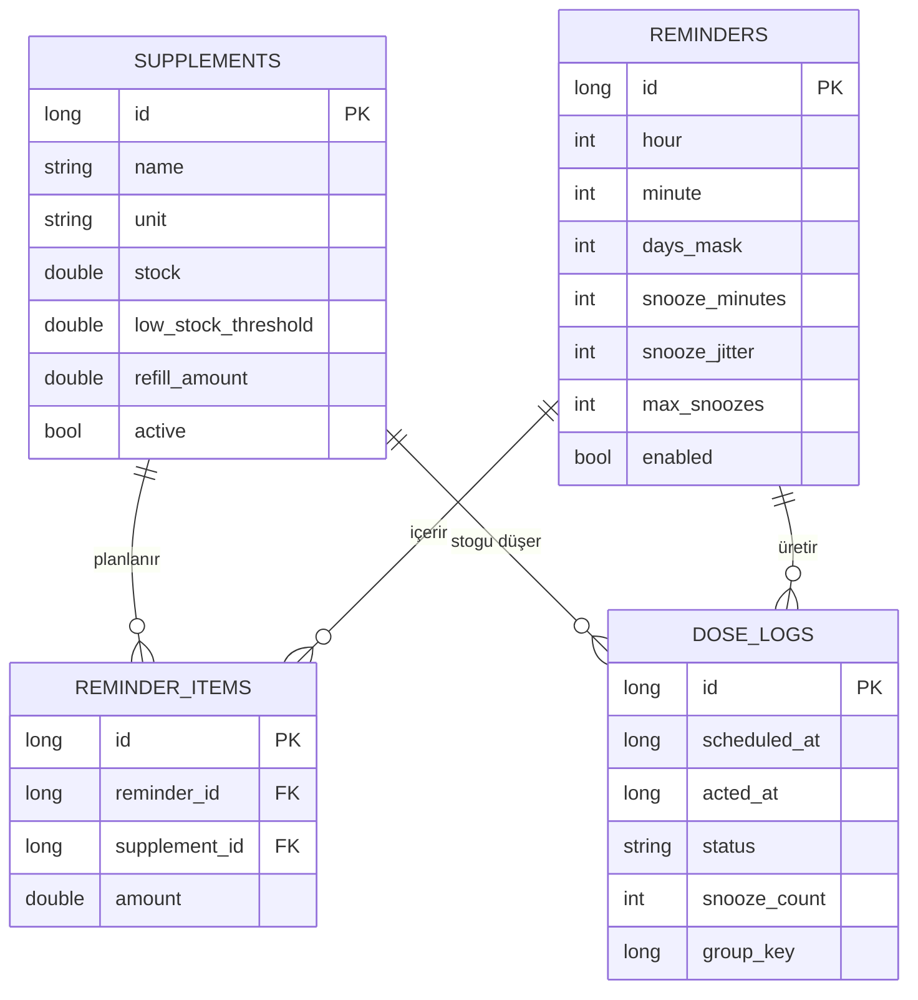
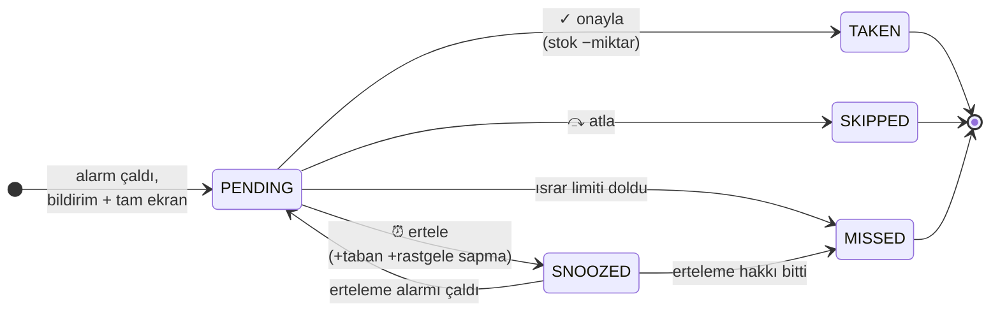
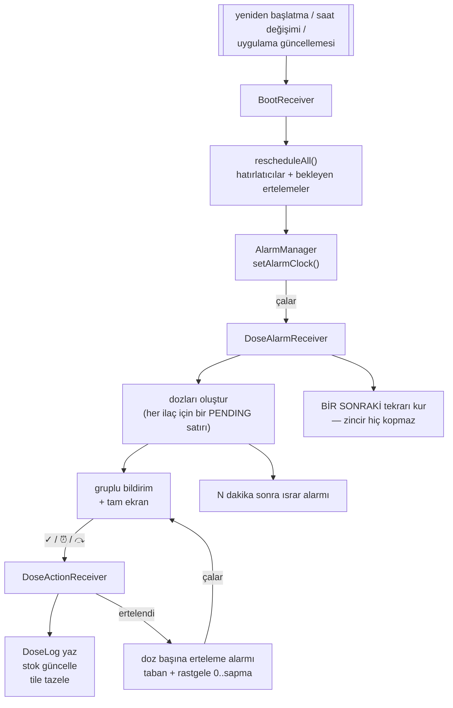
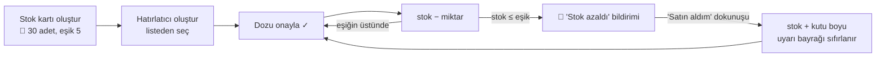

<div align="center">

# 💊 DoseWear

**Telefon gerektirmeyen Wear OS ilaç & takviye takip uygulaması.**
Telefon yok. Bulut yok. Hesap yok. Verin saatten hiç çıkmıyor.

<p>
  <a href="README.md"></a>
  <a href="README.tr.md"></a>
</p>

<p>
  
  
  
  
  
</p>

</div>

---

## Ekran görüntüleri

<!-- PNG'leri docs/screenshots/ altına bu isimlerle koy, otomatik görünürler. -->

| Ana ekran | Hatırlatıcılar | Doz onayı | Stok kartı |
|:---:|:---:|:---:|:---:|
|  |  |  |  |

| Hatırlatıcı düzenleme | Geçmiş | Ayarlar & teşhis | Tile |
|:---:|:---:|:---:|:---:|
|  |  |  |  |

---

> [!WARNING]
> **Tıbbi cihaz değildir.** DoseWear kişisel bir hatırlatma aracıdır; tıbbi tavsiye vermez ve klinik
> kullanım için sertifikalı değildir. Alarmın zamanında gelmesi son tahlilde saatinin işletim
> sistemine ve pil politikalarına bağlıdır — kritik ilaçlar için tek başına buna güvenme. Güvenmeden
> önce uygulamanın içindeki teslim testini mutlaka çalıştır
> ([Güvenilirliği doğrulama](#güvenilirliği-doğrulama)).

---

## Neden var?

İlaç hatırlatıcılarının çoğu, saatte sadece bir eşlikçisi olan telefon uygulamaları. Telefonu başka
odada bıraktıysan dozu kaçırıyorsun. DoseWear **tamamen saatte** çalışır: ilacı saatten eklersin,
saatten titrer, saatten onaylarsın, geçmiş de saatte durur.

Ayrıca genel hatırlatıcı uygulamalarının yanlış yaptığı iki şeyi çözüyor:

1. **09:00'daki üç hap tek bir hatırlatıcı değildir.** Ayrı ayrı onaylanan üç şeydir — ve ikisini
   ertelersen aynı dakikada geri gelip birbirlerini gömmemeleri gerekir.
2. **Stok bilgisi olmayan hatırlatıcı yarım bir sistemdir.** Dozu onaylamak, çekmecede gerçekten
   kalan miktarı düşürmeli ve bitmeden *önce* "al" demeli.

---

## Özellikler

### Temel

- 🔕 **Tamamen bağımsız** — `com.google.android.wearable.standalone = true`, sıfır telefon bağımlılığı
- 🔒 **Tasarımı gereği çevrimdışı** — saatte Room/SQLite, ağ izni yok, telemetri yok, hesap yok
- ⏰ **Yeniden başlatmayı atlatan kesin alarmlar** — `BOOT_COMPLETED`, saat değişimi ve uygulama güncellemesinde yeniden kurulur
- 🔋 **Arka plan servisi yok** — foreground service yok, `WorkManager` yok, polling yok
- 🌍 **Saatin dilini takip eder** — Türkçe saatte Türkçe, diğer her yerde İngilizce
- 🧩 **Tile + saat yüzü complication'ı** ile sıradaki doz

### Dozlama

- 💊 **Bir hatırlatıcıda birden fazla ilaç**, her biri ayrı onaylanır
- ⏰ **Ayarlanabilir erteleme + çakışma önleyici rastgele sapma** — ertelenen dozlar üst üste binmez
- 📣 **Tam ekran onay** — kilit ekranının üstünde ekranı uyandırır, sen bir şey yapana kadar alarm gibi kesintisiz titrer
- 🔁 **Artan ısrar** — onaylanana kadar N dakikada bir titrer, sonra dozu "kaçırıldı" olarak kaydeder
- 🔥 **Seri ve günlük ilerleme** — onaylamayı ödüllendiren küçük dokunuşlar

### Stok

- 📦 **Her takviye için stok kartı** — birim, kalan miktar, uyarı eşiği, kutu boyu
- ➖ **Her onaylanan dozda otomatik düşüm**
- 🛒 **"Satın aldım"** bildirim butonu ile tek dokunuşta stok yenileme

---

## Nasıl çalışıyor?

### Veri modeli

Dört Room tablosu. Onay mekanizmasının kendisi `dose_logs`.



| Tablo | Ne tutar |
|---|---|
| `supplements` | **Stok kartı** — her ilaç/takviye için tek satır; ne zaman sipariş verileceğini bilmek için gereken her şey |
| `reminders` | **Bir saat** — saat, dakika, gün bit maskesi ve kendi erteleme politikası |
| `reminder_items` | N:N bağlantı + bu hatırlatıcıda o takviyeden ne kadar alınacağı |
| `dose_logs` | **Planlanan her doz ve ona ne yaptığın.** Onay kaydı ve geçmiş bu tablo |

`dose_logs` takviye adını denormalize tutar; takviyeyi silmek geçmişi bozmaz.

### Doz yaşam döngüsü



Stoğa yalnızca `TAKEN` dokunur. Atlamak ve kaçırmak bilerek stoğu değiştirmez.

### Alarm zinciri



**Neden `setExactAndAllowWhileIdle()` yerine `setAlarmClock()`?**
`setExactAndAllowWhileIdle` Doze'dan muaftır ama birçok OEM pil katmanı (özellikle Xiaomi HyperOS)
onu yine de kısıtlar; ayrıca Android bir Doze penceresinde uygulama başına kabaca bir tane garanti
eder. `setAlarmClock` ise sistemin **gerçek bir çalar saat** olarak ele aldığı türdür: en yüksek
öncelik, Doze'dan ve çoğu OEM kısıtından muaf. Bedeli durum çubuğundaki küçük alarm simgesi —
istersen Ayarlar'dan `setExactAndAllowWhileIdle`'a geri dönebilirsin.

`WorkManager` bilerek **kullanılmıyor**: dakika hassasiyeti garantisi vermiyor.

### Aynı anda birden fazla ilaç

İki mekanizma birlikte çalışır:

**1 — Gruplu hatırlatıcı.** Bir hatırlatıcı istediğin kadar takviye tutabilir. Tek bildirim olarak
gelirler, tam ekran onay sayfası hepsini listeler ve her birinin kendi ✓ / ⏰ / ⤼ satırı olur.
Gerçekten hepsini aldıysan "hepsini aldım" kısayolu var.

**2 — Çakışma önleyici erteleme.** Erteleme süresi arayüzde hatırlatıcı bazında ayarlanır
(varsayılan 10 dk). Üstüne `0..sapma` dakika rastgelelik eklenir — ve bu **her doz için ayrı**
hesaplanır:

```
doz A → şimdi + 10 + rastgele(0..3) = 09:12
doz B → şimdi + 10 + rastgele(0..3) = 09:14
```

Böylece üç ilacın ikisini ertelemek asla aynı dakikaya iki bildirim düşürmez. Sapmayı `0` yaparsan
tamamen kapanır.

### Onaya teşvik

- Doz bildirimi `setOngoing(true)` — kaydırıp atılamaz, yalnızca işlem yapılabilir
- `setFullScreenIntent` ekranı uyandırır, onay sayfasını kilit ekranının üstünde açar
- `USAGE_ALARM` üzerinde artan dalga formunda titreşim
- Hâlâ onaylanmadıysa N dakikada bir (varsayılan 5, ayarlanabilir) tekrar titrer; N ısrardan sonra
  (varsayılan 3) sonsuza kadar dırdır etmek yerine dozu `MISSED` olarak kaydeder
- Pozitif taraf: ana ekranda günlük `alınan / planlanan` çubuğu ve 🔥 üst üste gün serisi

### Stok akışı



Uyarı bayrağı, aynı stok uyarısının her dozda tekrar tekrar çıkmasını engeller.

---

## Ekranlar

| Ekran | Ne işe yarar |
|---|---|
| **Ana ekran** | Bugünün ilerleme çubuğu, seri, sıradaki doz, onay bekleyenler, stok uyarıları |
| **Takviyelerim** | Tüm stok kartları, renk kodlu, azalanlar işaretli |
| **Takviye detayı** | Büyük kalan-stok göstergesi, ± düzeltme, "Satın aldım", son hareketler |
| **Takviye düzenleme** | Ad, doz bilgisi, birim, stok, eşik, kutu boyu, renk, aktif/pasif |
| **Hatırlatıcılar** | Saat, günler ve ilaç sayısıyla tüm hatırlatıcılar |
| **Hatırlatıcı düzenleme** | Saat ±, gün seçici, çoklu takviye seçimi + miktar, erteleme politikası |
| **Doz onayı** | Tam ekran; ilaç başına ✓ / ⏰ / ⤼ ve "hepsini aldım" |
| **Geçmiş** | Gün gün alınan / ertelenen / atlanan / kaçırılan, erteleme sayılarıyla |
| **Ayarlar** | İzin durumu, alarm modu, ısrar politikası, varsayılanlar, **teslim teşhisi** |
| **Tile & complication** | Tek bakışta sıradaki doz (ya da bekleyen sayısı) |

Metin girişi Wear'in standart `RemoteInput` ekranını kullanır (klavye / el yazısı / sesli giriş).
Tüm sayısal alanlar ± düğmeli, yani saatte klavyeye hiç ihtiyaç duymazsın.

---

## Derleme & kurulum

Play Store sürümü yok — ADB ile yükleniyor.

```bash
# Saatte:
#   Ayarlar → Sistem → Hakkında → "Yapı numarası"na 7 kez dokun
#   Ayarlar → Geliştirici seçenekleri → "ADB hata ayıklama" + "Kablosuz hata ayıklama" açık

adb pair <SAAT_IP>:<ESLESTIRME_PORTU>   # saatte görünen kodu gir
adb connect <SAAT_IP>:<PORT>
adb devices                             # saatin listede görünmeli

./gradlew installDebug
# veya
adb install -r app/build/outputs/apk/debug/app-debug.apk
```

Gereksinimler: Android Studio (AGP 9), JDK 17+, Wear OS 5+ saat (`minSdk 30`).

### Release derlemesi (imzalı APK)

Android Studio'nun ürettiği debug APK çalışır ama imzası bir yıl sonra dolar ve makine
değişince değişir. Uzun vadeli kişisel kullanım için kendi anahtarınla imzala:

```bash
# 1. Bir kez, projenin kökünde anahtar üret
keytool -genkey -v -keystore dosewear.jks -alias dosewear \
        -keyalg RSA -keysize 2048 -validity 10000

# 2. keystore.properties.example -> keystore.properties olarak kopyala ve doldur
#    (.jks de .properties de .gitignore'da)

# 3. Derle
./gradlew assembleRelease
# -> app/build/outputs/apk/release/app-release.apk

# 4. Kur (debug sürümünü önce kaldır — imzalar farklı)
adb uninstall com.example.dosewear
adb install -r app/build/outputs/apk/release/app-release.apk
```

Sonrasında `app/build.gradle.kts` içindeki `versionCode`'u arttırıp `adb install -r` dersen
veritabanını silmeden günceller. **`dosewear.jks` dosyasını ve parolalarını yedekle** —
kaybedersen tek yol tamamen kaldırıp yeniden kurmak olur, o da stok ve geçmişi siler.


---

## Kurulumdan sonra

Uygulamayı aç → **Ayarlar**. Üç satır da ✅ olmalı:

| Satır | Ne yapar |
|---|---|
| Kesin alarm izni | `SCHEDULE_EXACT_ALARM` — `USE_EXACT_ALARM` sayesinde genelde otomatik verilir |
| **Pil optimizasyonu** | Uygulamayı Doze beyaz listesine alır — **en kritik madde** |
| Tam ekran uyarı izni | Android 14+ için `USE_FULL_SCREEN_INTENT` |

### Xiaomi HyperOS (ve diğer agresif OEM katmanları)

Beyaz liste tek başına çoğu zaman yetmez. HyperOS'ta ayrıca:

1. **Ayarlar → Uygulamalar → DoseWear → Pil tasarrufu → "Kısıtlama yok"**
2. **Otomatik başlatma (Autostart)** → DoseWear açık
3. Son uygulamalar ekranında **DoseWear kartını kilitle** (aşağı çek → kilit simgesi)
4. Bazı sürümlerde ayrıca **Güvenlik uygulaması → Pil → Uygulama pil tasarrufu → DoseWear →
   Kısıtlama yok**

---

## Güvenilirliği doğrulama

Ayarlar → **Teşhis**, her alarm için *planlanan vs. gerçekleşen* zamanı ve o güne kadarki en kötü
gecikmeyi kaydeder. Sırayla:

1. **"Test alarmı kur (2 dk)"** — uygulama açıkken temel doğrulama. `✅ Zamanında` beklenir.
2. Aynısını saati bileğinden çıkarıp ekran kapalıyken tekrarla (hafif Doze).
3. **"Gece testi kur (8 saat)"** — saati şarjdan çıkar, gece bırak. Sabah: bildirim geldi mi,
   gecikme kaç? En kötü gecikme ~2 dakikanın üstündeyse OEM katmanı seni kısıtlıyor demektir —
   yukarıdaki adımları gözden geçir.
4. **Yeniden başlatma testi** — saati kapat-aç ve "Alarmları yeniden kur"a dokunmadan bir sonraki
   dozun geldiğini doğrula. Bu, `BootReceiver`'ın işini yaptığını kanıtlar.

---

## Proje yapısı

```
app/src/main/java/com/example/dosewear/
├── DoseWearApp.kt              Application: kanallar + açılışta alarm zinciri onarımı
├── data/
│   ├── Model.kt                Entity'ler, DoseStatus, ilişkiler, biçimlendiriciler
│   ├── Dao.kt                  Room DAO'ları (Flow tabanlı okuma)
│   ├── AppDatabase.kt          Room veritabanı
│   ├── DoseRepository.kt       Tüm iş mantığı: onay, erteleme, stok, uyum, seri
│   └── Prefs.kt                Ayarlar + alarm teslim teşhisi
├── alarm/
│   ├── AlarmScheduler.kt       setAlarmClock / setExactAndAllowWhileIdle, sonraki tetik hesabı
│   ├── DoseAlarmReceiver.kt    Hatırlatıcı çaldı · erteleme doldu · ısrar
│   ├── DoseActionReceiver.kt   Bildirim butonları → DoseLog + stok
│   └── BootReceiver.kt         Reboot / saat değişimi / güncelleme sonrası her şeyi yeniden kurar
├── notif/DoseNotifier.kt       Gruplu bildirimler, tam ekran, titreşim, stok uyarısı
├── presentation/               Compose arayüz, navigasyon, tam ekran AlarmActivity
├── tile/MainTileService.kt     ProtoLayout tile: sıradaki doz
├── complication/               Saat yüzü complication'ı: sıradaki doz
└── util/Surfaces.kt            Tile/complication tazeleme (olay tetiklemeli, asla periyodik değil)
```

## Teknoloji

Kotlin · Wear için Jetpack Compose (Material 2.5) · Wear Compose Navigation · Room (KSP) ·
AlarmManager · NotificationCompat · ProtoLayout (Tile) · Watch Face Complications ·
metin girişi için `androidx.wear:wear-input`.

Dependency injection kütüphanesi yok, ağ katmanı yok, analitik yok.

---

## Sürüm geçmişi

### 1.2 — `versionCode 3`

- **Tile artık sıradaki beş dozu** listeliyor (önceden iki).
- **Alarm sesi değişti**: kesintisiz çalan bir melodi yerine saatin bildirim sesi
  2 saniyede bir tekrarlıyor, titreşim ritmiyle senkron. Uyandıracak kadar belirgin,
  siren gibi değil.

### 1.1 — `versionCode 2`

- **Alarm sesi eklendi.** Artık ses ve titreşimin sahibi, alarm çaldığı sürece yaşayan
  bir foreground servis (`AlarmAlertService`). Önceden titreşim milisaniyeler içinde ölen
  bir `BroadcastReceiver`'dan tetikleniyordu ve içinde bir `MediaPlayer` yaşayamıyordu —
  sesin hiç çalmamasının sebebi buydu.
- **Nereden onaylarsan onayla alarm susuyor.** Bildirim butonu, uygulama içi butonlar ve
  tam ekran onay sayfası tek bir durdurma noktasından geçiyor.
- **Tam ekran sayfa açılınca artık alarmı susturmuyor** — yalnızca gerçek bir işlem
  (aldım / ertele / atla) susturuyor. Israr tekrarlarında ekran zorla öne getirilmiyor.
- **Geçmişten sonradan onaylama.** Geçmişte onaylanmamış bir doza dokunup "Şimdi aldım"
  diyebilirsin: alım saati o an olur ve stok o anda düşer.
- Ana ekrana **"Bugün kaçırılan"** bölümü, aynı tek dokunuşluk onayla.
- **Tile**: dikey ortalama düzeltildi (iç sütun tüm alanı kaplayıp içeriği yukarı
  yapıştırıyordu) ve sıradaki iki doz gösterilmeye başlandı.
- **Ayarlar**: "Alarm sesi" aç/kapa.

### 1.0 — `versionCode 1`

İlk sürüm.

- Telefon gerektirmeyen Wear OS ilaç ve takviye takipçisi; saatte Room/SQLite, ağ izni
  yok, hesap yok.
- `setAlarmClock` ile kesin alarmlar; yeniden başlatma, saat değişimi ve uygulama
  güncellemesi sonrası yeniden kuruluyor.
- Bir hatırlatıcıda birden fazla ilaç, her biri ayrı onaylanıyor; doz başına rastgele
  sapmalı erteleme.
- Tam ekran onay ve artan ısrar; onaylanmayan doz sonsuza kadar dırdır etmek yerine
  "kaçırıldı" olarak kaydediliyor.
- Takviye başına stok kartı ve azalınca satın alma uyarısı.
- Hatırlatıcı kopyalama, iki adımlı silme onayı.
- Sıradaki doz için tile ve saat yüzü complication'ı.
- Arayüz saatin dilini takip ediyor (Türkçe / İngilizce).
- R8 açıldı: 29 MB → 2.7 MB.

---

## Yol haritası

- [ ] Veritabanı yedekleme / geri yükleme
- [ ] Haftalık uyum grafiği
- [ ] Sabit saati olmayan "gerektiğinde" (PRN) dozlar
- [ ] Takviye başına not ve fotoğraf

## Katkı

Issue ve PR'lar açığa. Bu proje tek bir saat için kişisel bir ihtiyaçtan doğdu; test edemediğim
donanımlarda pürüzler olması normal. Pil katmanı alarmları bozan bir OEM bulursan, lütfen Ayarlar
ekranındaki **Teşhis** değerleriyle birlikte issue aç — en işe yarar veri o.

## Lisans

[MIT](LICENSE)
